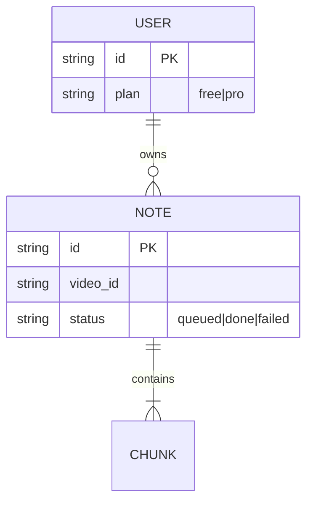

# ARCHITECTURE (시스템 설계)

## 구조

- Cloudflare Workers (API) + Queue (요약 잡) + D1 (노트 저장) + R2 (내보내기 파일)
- 요약 워커: 자막 우선, 없으면 Whisper 경로 — Whisper는 Pro 전용 (GTM §가격 결정 반영)
- 원본 비보존: 자막 원문·음성 파일은 요약 완료 즉시 폐기 — `../adr/ADR-00001-no-source-retention.md`

## 데이터 모델 (ERD)

## 외부 연동 (Integrations)

| 대상 | 용도 | 계약 위치 |
|---|---|---|
| YouTube Data API | 메타데이터·자막 | repo `specs/youtube.md` |
| Anthropic API | 청크 요약 | repo `specs/summarize.md` — 길이 상한은 POL-00001 |
| Stripe | Pro 결제 | webhook 1종 (checkout.completed) |

## 결정 기록

- 되돌리기 어려운 결정만 ADR — 3중 게이트(불가역·의아·트레이드오프): `../adr/ADR-0000N-<slug>.md`
- 게이트 미달 결정은 해당 FEAT §TDC의 "왜 이렇게" bullet로 남긴다
