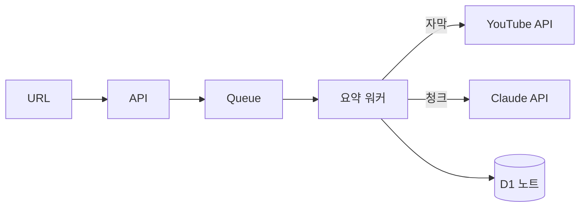
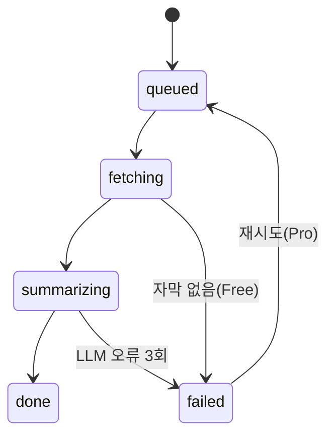

# FEAT-00001 · summarize

## FRD (기능 요구사항 — what)

- 무엇: URL 1개 → 타임스탬프 요약 노트 1개 — PRD R1의 실행 스펙
- 흐름 (사용자 관점)
  1. URL 붙여넣기 → 즉시 잡 큐잉 응답 — 동기 대기 없음
  2. 완료 시 노트 뷰 + 토스트 · 실패 시 사유 노출 — 자막 없음(Free)이면 Whisper 업그레이드 안내
- 수용 기준
  - 자막 있는 20분 영상: 60초 내 노트 생성
  - 무자막 영상 + Free: Whisper 경로 차단 + 업그레이드 안내
  - 같은 URL 재제출: 새 잡 대신 기존 노트 반환 (멱등)
  - 노트 총량 3,000자 이하 — `../policy/POL-00001-summarize-length.md`

## TDC (구현 설계 — how)

- 어떻게
  - API가 잡을 Queue에 넣고 즉시 202 반환 → 소비자 워커가 자막 fetch → 10분 청크 분할 → 청크당 요약 → 병합
  - 멱등 키 = `user_id + video_id` — §FRD 수용 기준 3의 구현
  - 자막 원문·음성 파일은 병합 직후 폐기 — `../../adr/ADR-00001-no-source-retention.md`
- 왜 이렇게
  - 동기 처리 대신 큐: Whisper 경로 3분+로 Workers CPU 한도 초과 — 큐가 유일 경로
  - 청크 병렬 대신 순차: 무료 티어 비용 상한 우선 — 되돌리기 쉬워 ADR 아님

### 데이터 흐름

### 상태기계 — NoteCard 상태와 1:1 (DESIGN §Components)

