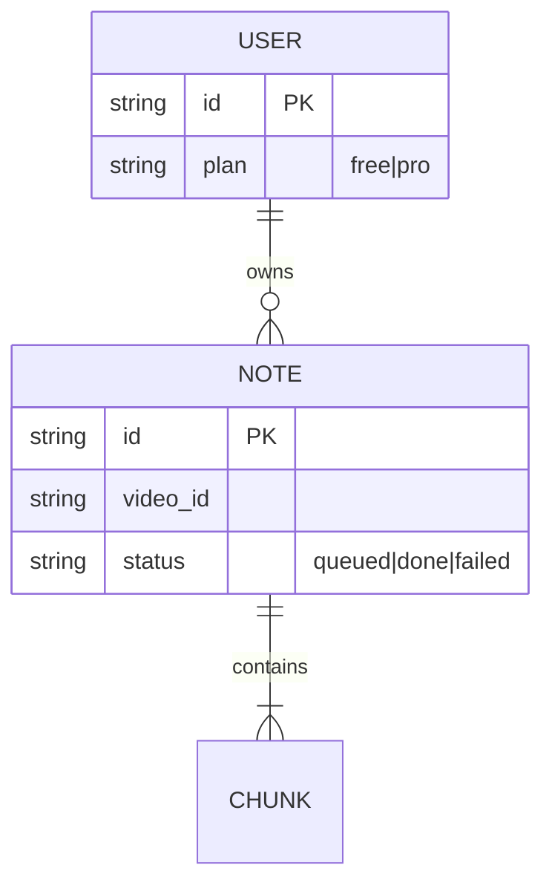

# ARCHITECTURE (시스템 설계)

## 구조
- Cloudflare Workers (API) + Queue (요약 잡) + D1 (노트 저장) + R2 (내보내기 파일)
- 요약 워커는 자막 우선, 없으면 Whisper 경로 (비용 10배 — [[BUSINESS]] §BM 반영)

## 데이터 모델 (ERD — Entity Relationship Diagram)
<!-- 구 ERD.md 흡수. DB가 무거워지면 그때 별도 파일로 분리 -->

## 외부 연동 (Integrations)
<!-- 구 INTEGRATION.md 흡수. 연동 계약이 파트너 스펙 수준으로 무거워지면 분리 -->
| 대상 | 용도 | 계약 위치 |
|---|---|---|
| YouTube Data API | 메타데이터·자막 | repo `specs/youtube.md` — 쿼터 [[knowledge]] 참조 |
| Anthropic API | 청크 요약 | repo `specs/summarize.md` |
| Stripe | Pro 결제 | webhook 1종 (checkout.completed) |

## 결정 기록
- 되돌리기 어려운 결정은 ADR로: `docs/adr/VDN-ADR-0000N.md`
