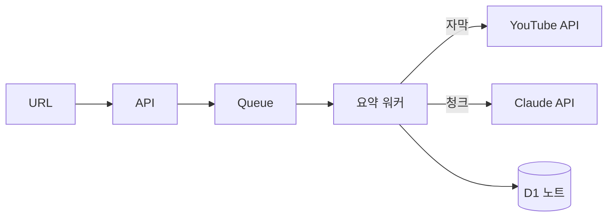
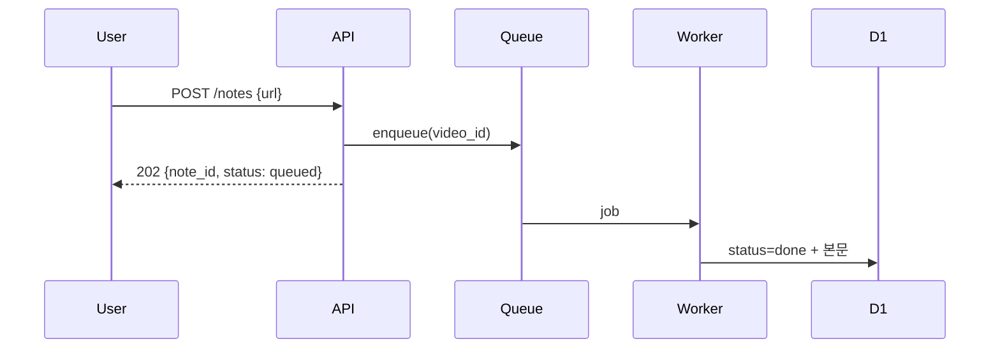
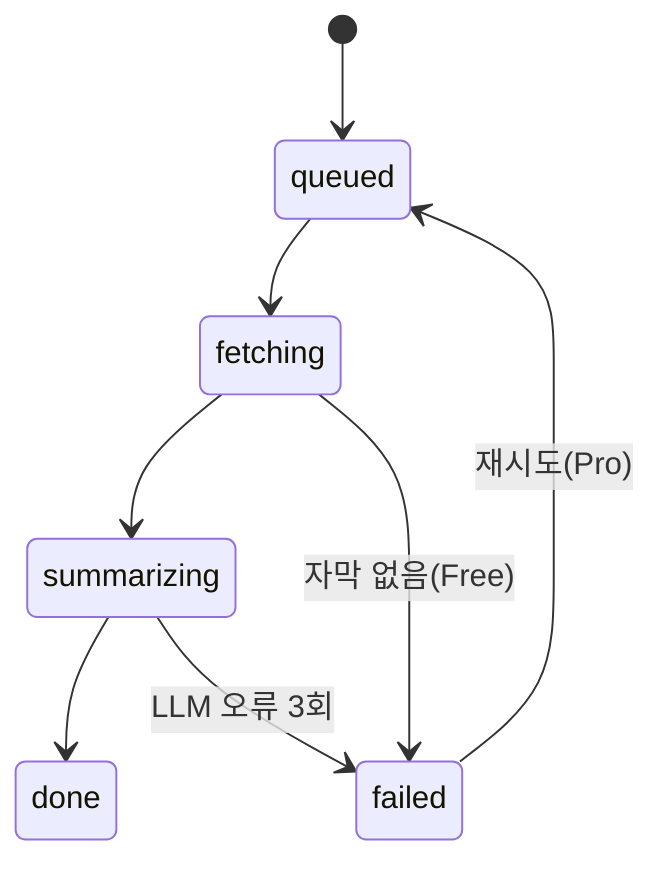

# TDC (Technical Design & Concept — 구현 설계) · summarize

## 어떻게
- API가 잡을 Queue에 넣고 즉시 반환. 소비자 워커가 자막 fetch → 10분 청크 분할 → 청크당 요약 → 병합.
- 멱등 키 = `user_id + video_id` (FRD 수용 기준 3의 구현).

## 왜 이렇게
- 동기 처리 대신 큐: Whisper 경로가 3분+라 Workers CPU 한도 초과 → 큐가 유일 경로.
- 청크 병렬 대신 순차: 무료 티어 비용 상한 우선 (ADR 후보 아님 — 되돌리기 쉬움).

## Diagrams
<!-- 구 DATA_FLOW·SEQUENCE·STATE_DIAGRAM 3파일 흡수. 산문은 위 절, 다이어그램만 여기 -->

### 데이터 흐름 (Data Flow)

### 시퀀스 (Sequence)

### 상태 (State) — 진짜 상태기계가 있어서 유지

